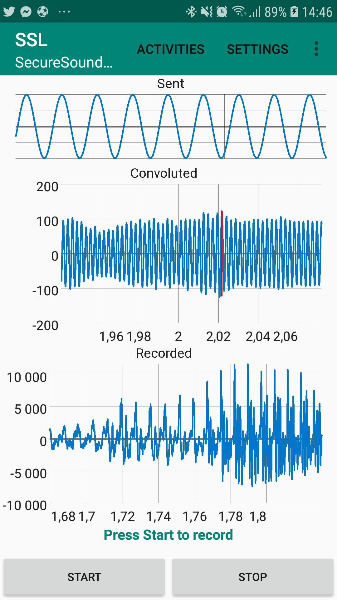

#SSLApp
> Secure Sound Localiation App

This android project (coded in *Kotlin*) is used to control the phone.

    

# How to use it

- Activities Menu:
  - `Manual`: At the beginning, only the the sent sound is displayed (hardcoded)
     1. Press *Start*
     2. Play the file `../common/sin.wav` with another device
     3. Press *Stop* (it is going to take some time to finish to record)
    
      Then the recorded sound and the convoluted sound should be plotted.
       If the switch *Save Record* is on, the recorded sound is saved in the folder `SSL/` of the phone, the extension of the file is `.pcm`.

      The application look for the maximum in the convoluted sound and indicates where it is with a red line.
  - `Handler`:
    - `offset` : number of seconds to wait after Start button is pressed
    - `duration`: duration of the recording
- Settings menu
  - `debug`: To have :black_circle: Dark Theme :black_circle: and log informations
  - `saveRecord`: To save the record in a file
- Version Menu : The different versions

> You can scroll and zoom with your finger in the graphs :ok_hand:

# Version to use
Use the version **4**.

## Version :four: :

For now, same as *Version 3*

## Version :three: :
- Use the toolbar menu
- :black_flag:  Dark Mode :black_flag: for *Debug* Mode
  

      
  
- All the options are in the `toolbar` menu
- Has 2 activities :
  - **Manual** : Almost like *Version2*
    

        
  - **Handler** :  Only a start button : 2 inputs : *Offset* and *Duration* to start the recording after `offset` seconds and for `duration` seconds.
    

        
- Can go from an activity to another
  - Can pass variable through activities !! :tada:
- Can go to the previous version
- `0` values are removed at the beginning and the end of the recording
- Can get the date in `ms`

## Version :two: :
- It uses the library `AudioRecorder`. It creates a Thread which put the data of the microphone in a buffer. And it reads the buffer.

  With this method, it is possible to actually store the values (of the waveform) of the sound recorded in a variable. It also can store it in a file, but the extension is `.pcm`, and we can't listen to it.
  
- The supposed received signal (sent but the *Central Unit*) is hard coded.

  The reason that it doesn't use the file `../common/sin.json` yet is because *Android Studio* builds the application and it is not obvious how to integrate an external file to the project.

- Display the recorded sound, the supposed sent sound by the *Central Unit* and the convoluted sound.

- Add the options `save record` and `debug`

    

## Version :one: :
- Uses the library `MediaRecorder` which allows to creates a `.mp3` file.
  
  The problem with that is we don't really control the data recorded and an `.mp3` file is compressed... The best would be to save a `.wav` file but it looks like it is impossible (or very hard).
   
- It is possible to pause the recording and resume it (I mean it is already coded in it, just copy past if you want it but I don't think we need it for the project)