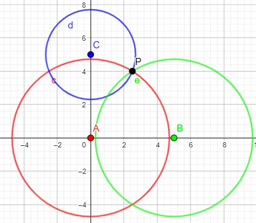
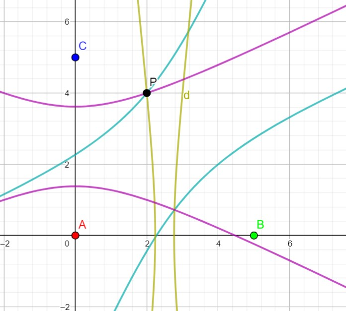

# `create_sound`

This is a Python Script to create the `.wav` file that the *Central Unit* should play in a speaker

For now, the produced sound is a sinus of frequence 440Hz (:musical_note:) for 0.25 seconds.
This python script creates 2 files:
- `../common/sin.wav`: File to play with the *Central Unit*
- `../common/sin.json`: The encoded sound

The goal would be to be able to open and integrate the file `sin.json` in build of the App (and not `sin.wav` because the data has been transformed to create the `.wav`) 

# `localise_circle`

Script to find a point `P` from the offsets and the positions of the sources

<p align="center">
    
</p>

[Geogebra](web/geogebra-export-circle.html)

Uses [*Gauss-Newton* or *Newton-Raphson* method]( https://fr.wikipedia.org/wiki/Algorithme_de_Gauss-Newton) to compute it numerically:


# `localise_hyperbole`

Script to find a point `P` from the offsets and the positions of the sources
But it is only working with the difference of offset so the starting time of the recording doesn't matter.

It is now the same as looking for the intersection of hyperboles:

<p align="center">
    
</p>

[Geogebra](web/geogebra-export-hyperbole.html)

Uses [*Gauss-Newton* or *Newton-Raphson* method]( https://fr.wikipedia.org/wiki/Algorithme_de_Gauss-Newton) to compute it numerically:

# Requirements

To install the requirements :
```
pip install -r requirements.txt
```